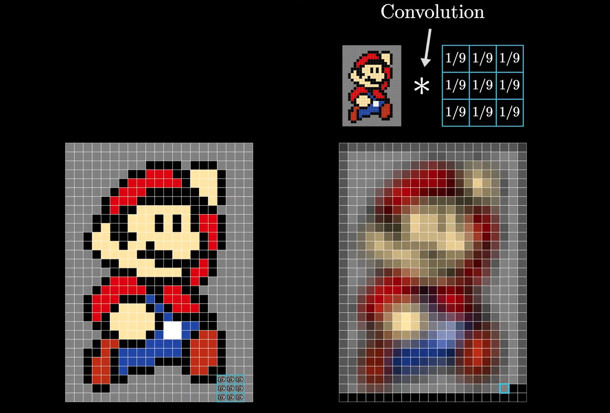

# Image Classification using CNNs

## Introduction

Imagine you spot a picture of a bobcat. Even if you've never seen one ever, you can tell it's a type of wild cat because of its appearance. This ability to recognize and categorize things, even when they're not entirely familiar, is learned from our experiences and observations. Computers use similar techniques to classify images through Convolutional Neural Networks. By analyzing vast datasets of labeled images, CNNs learn to recognize patterns and features, allowing them to accurately classify images. This makes them a powerful tool for tasks ranging from identifying objects in photos to diagnosing medical conditions from scans.

Image classification is essentially assigning labels to images based on pixel-level analysis. There are various types: Binary (two categories like benign/malignant tumors), Multiclass (three or more classes, e.g., diseases), Multilabel (items can have multiple labels, e.g., image colors) etc. In this blog we will focus on basic image classification task using MNIST dataset.

## What is Convolution?

<figure align = "center">
    
    <figcaption>Blurring using Convolution</figcaption>
</figure>

According to Wikipedia, convolution (denoted by `*` ) is the integral of the product of two functions after one is reflected about the y-axis and shifted. Intuitively, in image processing, convolution involves sliding a filter/kernel across an image to examine a small region of the image, performing a weighted sum of the pixel values it covers. The output matrix is called a feature map. Convolution allows us to perform operations like blurring, sharpening, and edge detection.

**Stride:** The kernel moves over the image pixel by pixel, with each step called a stride.

<figure align = "center">
    
    <figcaption>Convolution on 2D Matrix</figcaption>
</figure>

**Padding:** Convolution can underuse edge pixels, causing feature loss and shrinking output dimensions. Padding fixes this by adding empty pixels at the image edges, ensuring all pixels contribute equally.

<figure align = "center">
    
    <figcaption>Padding of 0's</figcaption>
</figure>

## What are CNNs?

Convolutional Neural Networks consist of convolutional layers, pooling layers, and fully connected layers, which work together to extract and learn hierarchical features from input images. Convolution layers have filters that learn to capture patterns such as edges and textures, although we cannot exactly know what really happens inside these large networks. Pooling layer extract important spatial information reducing the size of feature map.

These networks are preferred for grid-like data such as images/videos because they reduce the number of input nodes which makes them computationally efficient. Moreover, they take advantage of spatial correlation between pixels.

<figure align = "center">
    
    <figcaption>Basic CNN Architecture</figcaption>
</figure>

## Building an MNIST Classification Model with PyTorch

Now, let's see how we can build a simple image classification CNN model using PyTorch.

### Step 1: Import Libraries

```
import torch
import torch.nn as nn
import torch.optim as optim
import torchvision
import torchvision.transforms as transforms
```

### Step 2: Load and Prepare the Data

Now, we will load the MNIST dataset using PyTorch's torchvision library. This library provides easy access to many popular datasets.

The torchvision datasets contain PILImage images in the range `[0, 1]`, which we transform to Tensors normalized to the range `[-1, 1]`. This normalization aligns better with `ReLU`, as it handles negative values effectively and helps in faster convergence.

```
# Define transformations
transform = transforms.Compose([
    transforms.ToTensor(),  # Convert images to tensors
    transforms.Normalize((0.5,), (0.5,))  # Normalize pixel values to range [-1, 1]
])

# Load training and test datasets
trainset = torchvision.datasets.MNIST(root='./data', train=True, download=True, transform=transform)
testset = torchvision.datasets.MNIST(root='./data', train=False, download=True, transform=transform)

# Create data loaders
trainloader = torch.utils.data.DataLoader(trainset, batch_size=4, shuffle=True)
testloader = torch.utils.data.DataLoader(testset, batch_size=4, shuffle=False)

```

### Step 3: Define the CNN Model

We will define a simple CNN with three convolutional layers, followed by max pooling layers, and then flatten the output to pass through two fully connected layers.

```
class Net(nn.Module):
    def __init__(self):
        super().__init__()
        self.conv1 = nn.Conv2d(1, 6, 5)
        self.pool = nn.MaxPool2d(2, 2)
        self.conv2 = nn.Conv2d(6, 16, 5)
        self.fc1 = nn.Linear(16 * 5 * 5, 120)
        self.fc2 = nn.Linear(120, 84)
        self.fc3 = nn.Linear(84, 10) # MNIST has 10 classes i.e. 0-9 digits

    def forward(self, x):
        x = self.pool(F.relu(self.conv1(x)))
        x = self.pool(F.relu(self.conv2(x)))
        x = torch.flatten(x, 1) # flatten all dimensions except batch
        x = F.relu(self.fc1(x))
        x = F.relu(self.fc2(x))
        x = self.fc3(x)
        return x


net = Net()
```

### Step 4: Train the Model

Next, we will define the loss function and optimizer, and then train the model.

```
# Define loss function and optimizer
criterion = nn.CrossEntropyLoss()
optimizer = optim.Adam(model.parameters(), lr=0.001)

# Training loop
for epoch in range(10):  # 10 epochs
    running_loss = 0.0
    for i, (images, labels) in trainloader:
        # Zero the parameter gradients
        optimizer.zero_grad()

        # Forward pass
        outputs = model(images)
        loss = criterion(outputs, labels)

        # Backward pass
        loss.backward()
        optimizer.step()

        running_loss += loss.item()
        if i % 2000 == 1999:    # print every 2000 mini-batches
            print(f'[{epoch + 1}, {i + 1:5d}] loss: {running_loss / 2000:.3f}')
            running_loss = 0.0
```

### Step 5: Evaluate the Model

Finally, we will evaluate the model's performance on the test dataset.

```
correct = 0
total = 0

# No gradient calculation for evaluation
with torch.no_grad():
    for images, labels in testloader:
        outputs = model(images)
        _, predicted = torch.max(outputs.data, 1)
        total += labels.size(0)
        correct += (predicted == labels).sum().item()

print(f'Accuracy of the model on the test images: {100 * correct / total:.2f}%')
```

## Assessment

Question - Consider an image of size (n x n), filter/kernel of size (k x k), stride s, and padding p. The size of the feature map will be: \_\_\_ .

Answer -> $f = \left\lfloor\frac{n-k+2p}{s}\right\rfloor + 1$

<!-- <details markdown="1">
    <summary>Answer</summary>
    $$f = \left\lfloor\frac{n-k+2p}{s}\right\rfloor + 1$$
</details> -->

## References

1. [But what is a convolution? - 3Blue1Brown YouTube Video](https://www.youtube.com/watch?v=KuXjwB4LzSA)
2. [Intuitive Guide to Convolution](https://betterexplained.com/articles/intuitive-convolution/)
3. [Deep Learning with PyTorch: A 60 Minute Blitz](https://pytorch.org/tutorials/beginner/deep_learning_60min_blitz.html)
4. [Image Classification with Convolutional Neural Networks - StatQuest YouTube Video](https://www.youtube.com/watch?v=HGwBXDKFk9I)
